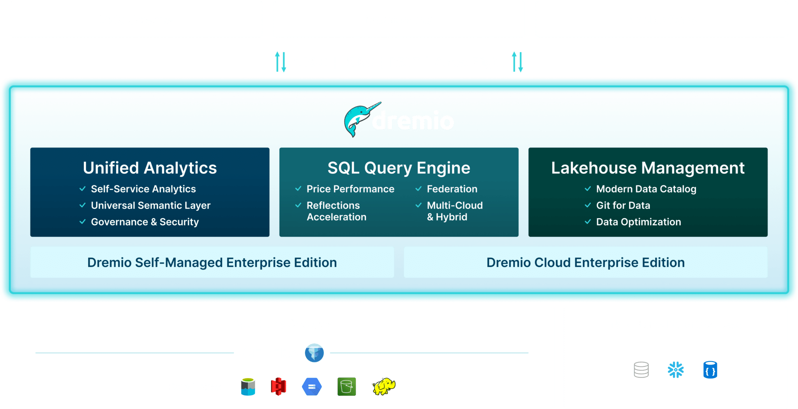

# Ansible Project for Dremio

The Dremio Unified Lakehouse Platform lets you connect, govern, and analyze all of your data, both in the cloud and on-premises.




## Requirements
* [Ansible](https://www.ansible.com/)
* [Python](https://www.python.org/)
* [Google SDK](https://cloud.google.com/sdk)


## Project Structure
- `ansible.cfg`: Ansible configuration file.
- `group_vars/`: Directory for group variable files.
- `inventory/`: Directory for inventory files.
- `misc/`: Directory for miscellaneous scripts.
- `roles/`: Directory for roles. Each role has its own directory with tasks, handlers, files, and templates.
- `site.yml`: Main playbook file.


## Roles
- `common` role includes tasks for setting up common configurations across all nodes. This includes installing Java and debugging tasks.
- `dremio` role includes tasks for setting up Dremio coordinators and executors. It also includes tasks for setting up firewalld rules for Dremio.
- `gcp_hosts` role includes tasks for setting up hosts in a Google Cloud Platform environment.
- `zookeeper` role includes tasks for setting up Zookeeper.


## Requirements configuration for GCP
* You should be authenticated in google using ADC
```sh
# Getting authentication and authorization
gcloud auth login
gcloud auth application-default login

# Set deployment project
gcloud config set project PROJECT_ID
```

* Edit inventory/inventory.gcp.yml
```sh
plugin: google.cloud.gcp_compute
projects:
  - PROJECT_ID
zones:
  - us-central1-a # ZONE_ID
filters:
  - status = RUNNING
  - scheduling.automaticRestart = true AND status = RUNNING
auth_kind: application
keyed_groups:
  - key: labels
groups:
  coordinator: "group_coordinator in name"
hostnames:
  - name
compose:
  ansible_host: selfLink
```

### Deploy on GCP
```sh
# Check ping on all hosts
ansible all -i inventory/inventory.gcp.yml -m ping
# Install Dremio
ansible-playbook site.yml -i inventory/inventory.gcp.yml
```

### Authors
*  [Edwin](https://github.com/ecaminero)
